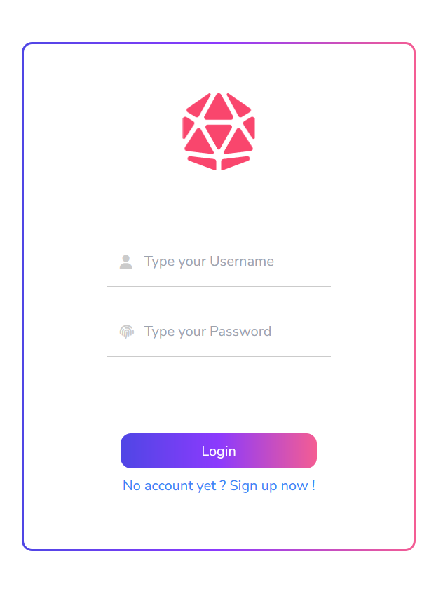
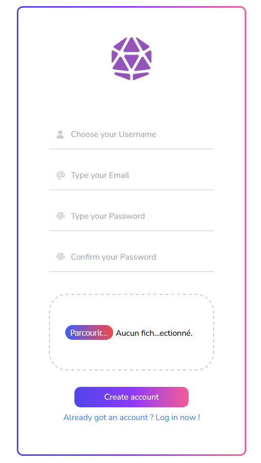
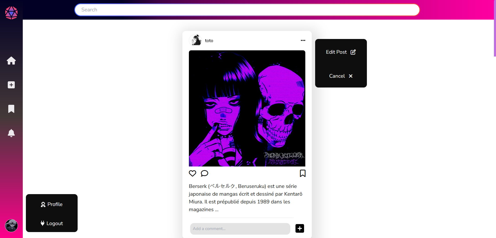

# InstaGame Clone instagrame

## ⚒ Project Overview

Welcome to InstaGame, an open-source project that draws inspiration from Instagram. Using PHP for backend and Vue.Js in frontend

## Screenshots

### Login


### SignUp



### Overview



### Post Card


### Add Post


### Key Contributors

Meet the talented individuals who have shaped InstaGame into what it is today:

👻 **Arnaud Humen**:
- Implemented User management (CRUD)
- Developed Login and Signup functionality
- Added the ability to leave Comments

👾 **Souhail Naji**:
- Implemented Post management (CRUD)
- Designed the Post card styling
- Developed Login and Signup functionality

🤖 **Jonathan**:
- Implemented Comment management (CRUD)
- Created the user profile section
- Developed the footer

## Tech Stack

**Client:**
- VUE.js
- CSS
- TailwindCSS

**Server:**
- PHP
- SQL

## Getting Started

1. Clone this repository.
2. Set up the server using PHP and SQL.
3. Set up the client using VUE.js, CSS, and TailwindCSS.
4. Explore the codebase to understand the implementation of user management, posts, and comments.
5. Customize and expand the project to build your own social media platform.
 
 ## Run Locally

Clone the project

```bash
  git clone https://github.com/doc-suell/instaGame.git
```

Go to the project directory

```bash
  cd instaGame/front
```

Install dependencies

```bash
  npm install
```

Start the server

```bash
  npm run dev
```

[](https://choosealicense.com/licenses/mit/)

## Contributing

We invite contributions from the open-source community. Whether you wish to add new features, improve existing ones, or fix bugs, your involvement is appreciated. Please don't hesitate to open an issue or submit a pull request, and let's collaborate to enhance InstaGame even further!

## Authors

Meet the creative minds behind InstaGame:

- [Arnaud Humen](https://github.com/arnaudhumen)
- [Souhail Naji](https://github.com/doc-souhail)
- [Jonathan](https://github.com/jojin889)